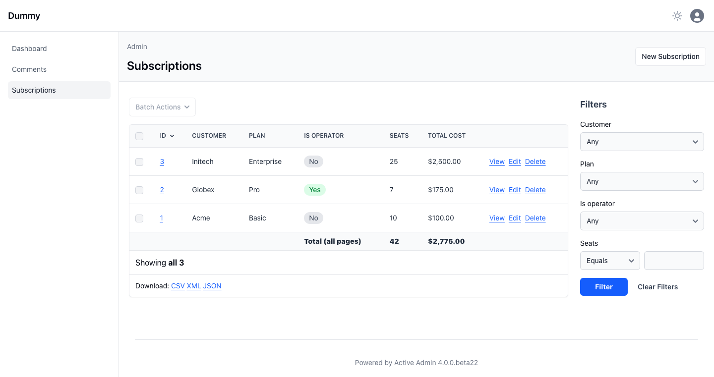
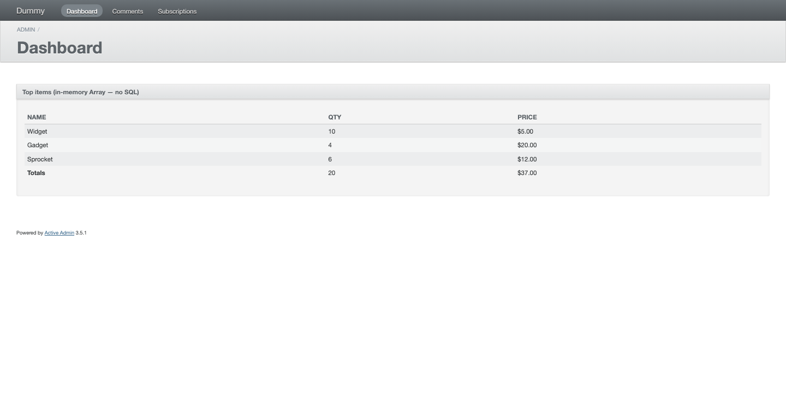

# activeadmin_table_footer

Adds a `<tfoot>` row to ActiveAdmin index tables with a simple per-column DSL
and an optional single-query aggregate shared across cells.

Works with **ActiveAdmin 3.5+ and 4.x**.



## Install

```ruby
# Gemfile
gem "activeadmin_table_footer"
```

## Usage

```ruby
ActiveAdmin.register Subscription do
  index footer_data: ->(collection) {
          totals = collection.joins(:plan).pick(
            Arel.sql("COALESCE(SUM(seats), 0)"),
            Arel.sql("COALESCE(SUM(seats * plans.monthly_price), 0)")
          )
          { total_seats: totals[0], total_cost: totals[1] }
        } do
    column :customer
    column :plan
    column :is_operator, footer: -> { strong { "Total (all pages)" } }
    column "Seats",      footer: -> { strong { footer_data[:total_seats].to_s } }, &:seats
    column :total_cost,  footer: -> { strong { number_to_currency(footer_data[:total_cost]) } } do |row|
      number_to_currency row.total_cost
    end
  end
end
```

`footer_data:` runs **once** against the filtered scope (without
`LIMIT/OFFSET/ORDER`), so totals cover every page — not just the visible
slice. The result is exposed inside each `column :x, footer:` Proc via the
`footer_data` method.

## `footer:` values

| Value | Behavior |
|---|---|
| `String` / Numeric | Rendered as-is |
| `:sum`, `:count`, `:average`, `:minimum`, `:maximum` | Aggregate over the (unscoped) collection — SQL for AR, Ruby for plain Arrays |
| `Proc` (arity 0) | Run inside the table — view helpers (`number_to_currency`, `link_to`), Arbre tags (`strong`, `span`), and `footer_data` work |
| `Proc` (arity 1) | Receives the unscoped collection as argument |
| `Arbre::Element` | Inserted directly |

Columns without `:footer` render an empty cell so widths align with the
header. `<tfoot>` itself appears only when at least one column has a footer —
regular tables are untouched.

## Plain-Array tables

Works the same when `table_for` gets a plain Array (custom panels, dashboards):



```ruby
table_for items do          # items = [DashboardItem.new(...), ...]
  column :name, footer: -> { strong { "Totals" } }
  column :qty,  footer: :sum
  column :price, footer: ->(arr) { number_to_currency(arr.sum(&:price)) }
end
```

Symbol aggregators fall back to `Enumerable` (nil-safe) when the collection
isn't an AR relation.

## Styling

For AA 4 (Tailwind) sensible defaults are applied. Override globally:

```ruby
# config/initializers/activeadmin_table_footer.rb
ActiveadminTableFooter.configure do |c|
  c.footer_th_class = "px-4 py-3 bg-blue-50 font-bold"
end
```

For AA 3 (Sass):

```scss
.index_table tfoot td {
  background: #f3f4f6;
  font-weight: 600;
  border-top: 1px solid #ddd;
  padding: 8px 10px;
}
```

## Compatibility

| AA | Status |
|---|---|
| 4.0.0.beta22 | ✅ |
| 3.5 | ✅ |

## License

MIT
